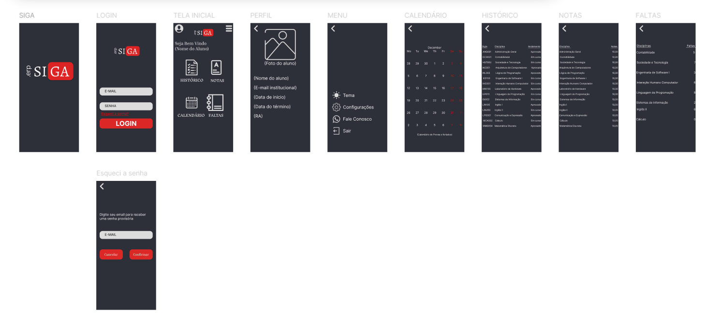
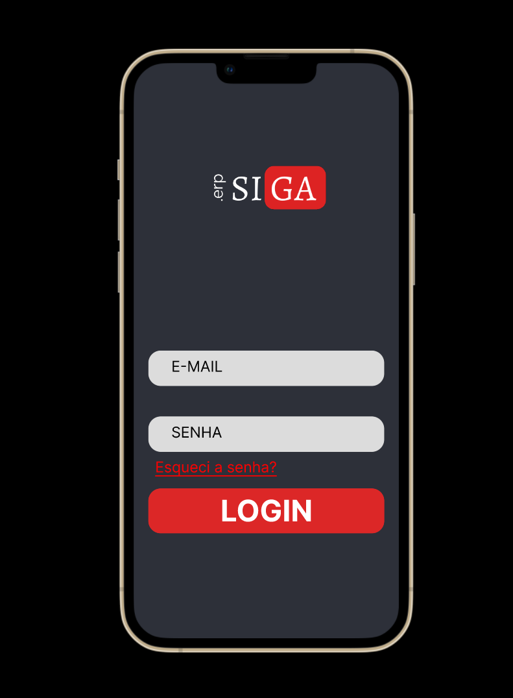
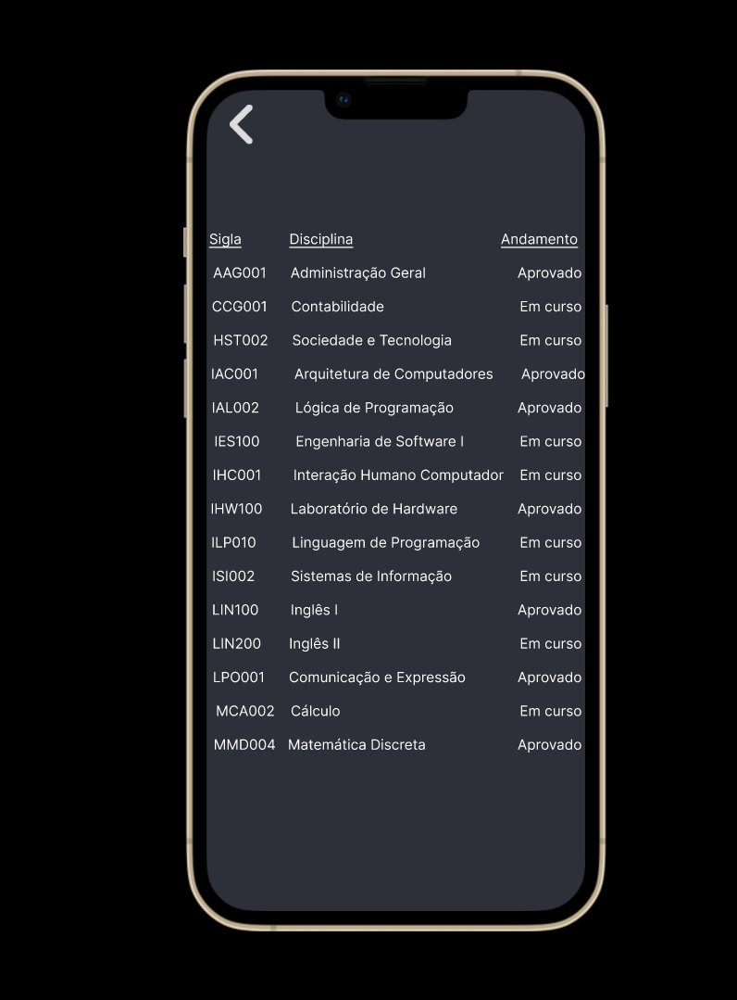

<h1 align="center"> Siga - Projeto de Design no Figma </h1>

## :memo: Descrição
O projeto Siga foi desenvolvido utilizando o Figma, uma ferramenta para design de interfaces e prototipagem. Este repositório documenta o design do projeto, e informações para colaboração e implementação. Além disso, o projeto aplica conceitos básicos de Interação Humano-Computador (IHC), focando em criar uma interface intuitiva e de fácil uso para melhorar a experiência do usuário.

## :books: Funcionalidades

  - Link para o acesso ao projeto no Figma: [Siga - Projeto Figma](https://www.figma.com/design/dAPj7ztZULfc2eq6bebKK8/Siga?node-id=0-1)

## :wrench: Tecnologias utilizadas
- **Figma**: Ferramenta principal para design e prototipagem

## Estrutura do Projeto
- **Página Inicial**: Design da tela inicial do sistema
- **Fluxo de Cadastro**: Protótipo para as telas de cadastro de usuários
- **Listagem e Edição**: Design das telas para listar, visualizar e editar informações dos usuários
- **Componentes Reutilizáveis**: Conjunto de elementos reutilizáveis, como botões, inputs e cartões

## 📷 Preview

### Visão Geral

### Login

### Historico

## 🧑‍🎓 Aprendizados
Durante o desenvolvimento do projeto Siga, aprendi a lidar com a criação de protótipos interativos, aplicando princípios de design centrado no usuário e boas práticas de usabilidade. O uso do Figma permitiu explorar diferentes abordagens de componentização, gerando um design mais consistente e fácil de manter. Além disso, adquiri uma compreensão mais aprofundada sobre a importância da colaboração e iteração contínua no processo de design, utilizando as ferramentas de comentários e versões do Figma para aperfeiçoar cada detalhe do projeto.

